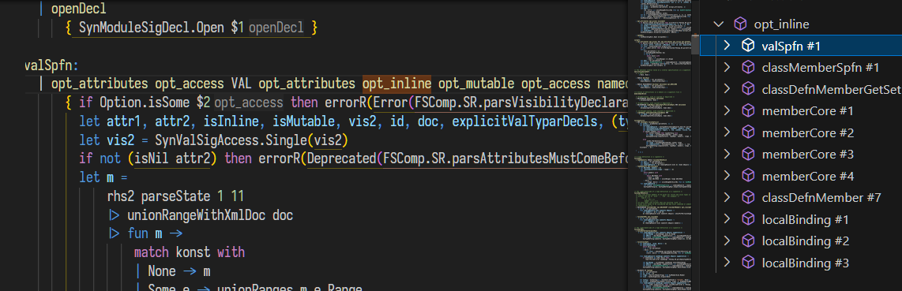

# fsyacc-language-service README

Provide simple language service for FsYacc (.fsy files).

## Features

1. ToolTip and InlayHint
    - Hover on a token or rule name to see the definition.
    - Inlay hints are shown for `$` variables in code blocks.

2. Goto definition and Find references

3. Auto completion
    - Outside code blocks:
    
    - Inside code blocks:
    

4. Document outline

5. Call hierarchy

## Requirements

.NET 6 or later.

<!-- ## Extension Settings

Include if your extension adds any VS Code settings through the `contributes.configuration` extension point.

For example:

This extension contributes the following settings:

* `myExtension.enable`: Enable/disable this extension.
* `myExtension.thing`: Set to `blah` to do something. -->

## Known Issues

Document outline and Inlay hints may fail while editing.
